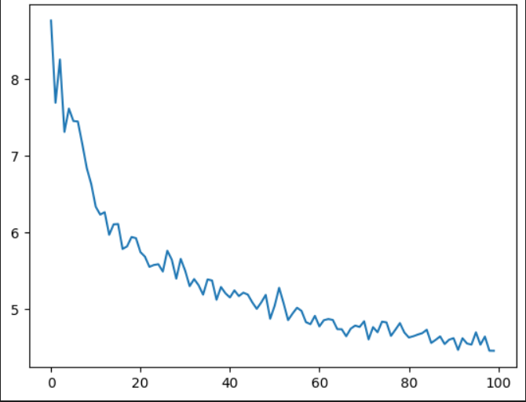

# Custom GPT Model with Multi-Head Attention

This project implements a custom GPT model using the GPT-2 tokenizer and multi-head attention mechanisms. The model was trained on a toy dataset, and significant improvements in performance were observed, with the loss decreasing from 11.x to 4.5.

## Features

- **Custom GPT Architecture**: Built from scratch with multi-head attention layers.
- **GPT-2 Tokenizer**: Utilized for efficient tokenization and pre-processing of text data.
- **Loss Reduction**: Achieved a reduction in loss from 11.x to 4.5 during training on a toy dataset.

## Results

- **Initial Loss**: 11.352
- **Final Loss**: 4.5 (after training on the toy dataset)
## Loss

## Contributing

Feel free to open issues or submit pull requests if you find any bugs or have suggestions for improvements.

## Contact

For questions or inquiries, please contact **Piyush Bhatt** at **bhattpiyush03@gmail.com**.
